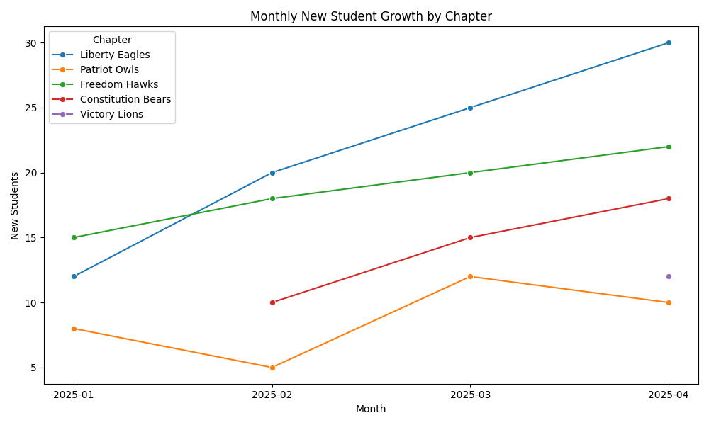
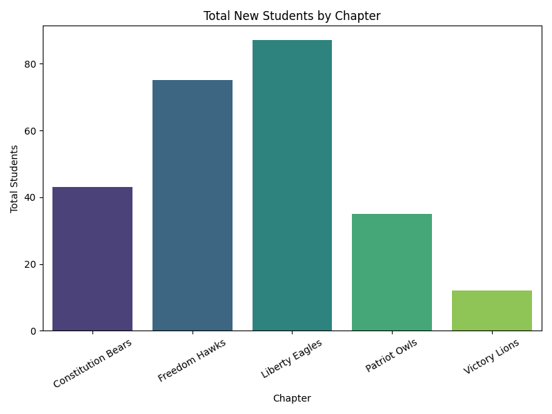
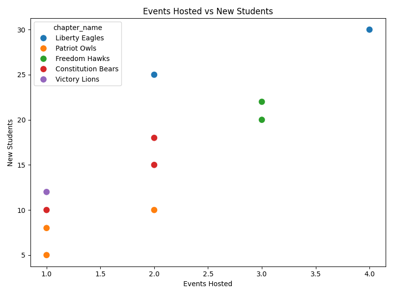
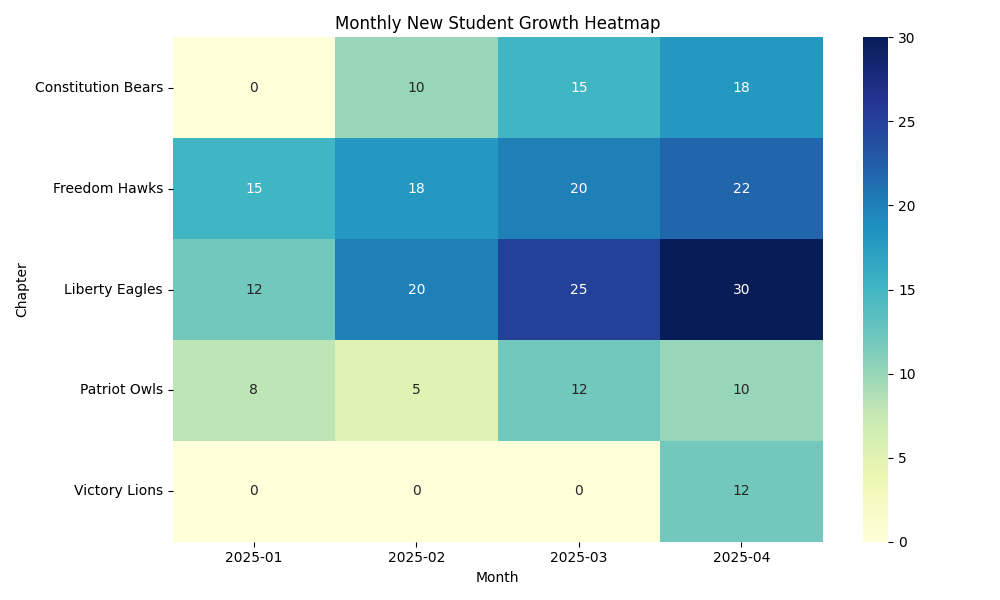

# Chapter Growth & Expansion Report

This report summarizes chapter growth trends, events, and recruitment performance based on collected data.

---

## 📈 Monthly Growth Over Time

**Insight:**  
- Liberty Eagles are consistently leading in recruitment.  
- Freedom Hawks are showing steady increases month over month.  
- Newer chapters like Victory Lions are emerging in April.

---

## 📊 Total Students by Chapter

**Insight:**  
- Liberty Eagles recruited the highest number of students overall.  
- Constitution Bears and Patriot Owls are in the middle tier.  
- Victory Lions, being new, have lower totals but show growth potential.  

---

## 🔎 Events vs. Students

**Insight:**  
- A positive correlation is visible: more events typically lead to more new students.  
- Liberty Eagles and Freedom Hawks leverage events effectively.  
- Some chapters, like Patriot Owls, may need to optimize event effectiveness.

---

## 🌍 Growth Heatmap

**Insight:**  
- West region (Liberty Eagles) consistently outperforms.  
- Midwest (Freedom Hawks) is strong in sustained recruitment.  
- South chapters are steadily expanding with Constitution Bears.  

---

## ✅ Key Takeaways
1. Hosting more events directly drives higher student recruitment.  
2. Established chapters outperform newer ones but newer chapters show strong growth potential.  
3. Regional differences suggest West and Midwest are strong, while East may need more support.  

---

📌 *Generated using Python (Pandas, Seaborn, Matplotlib).*
