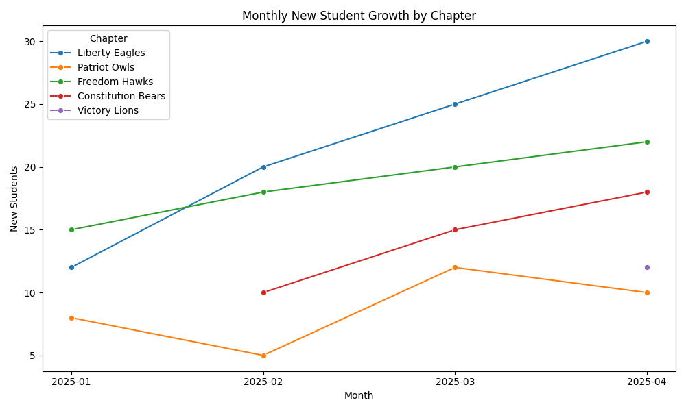
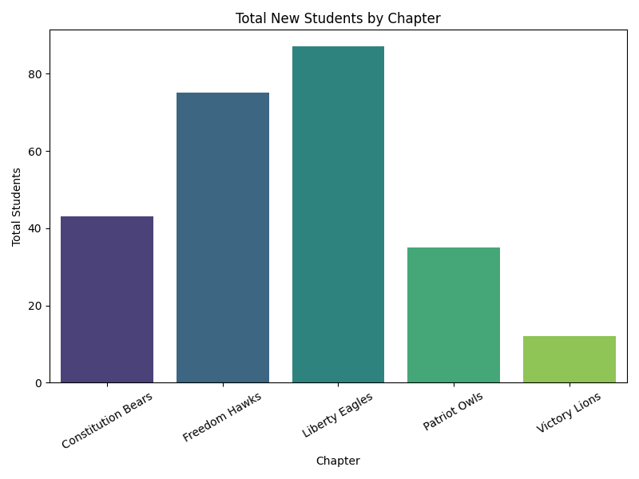
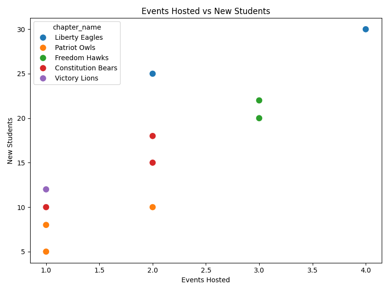
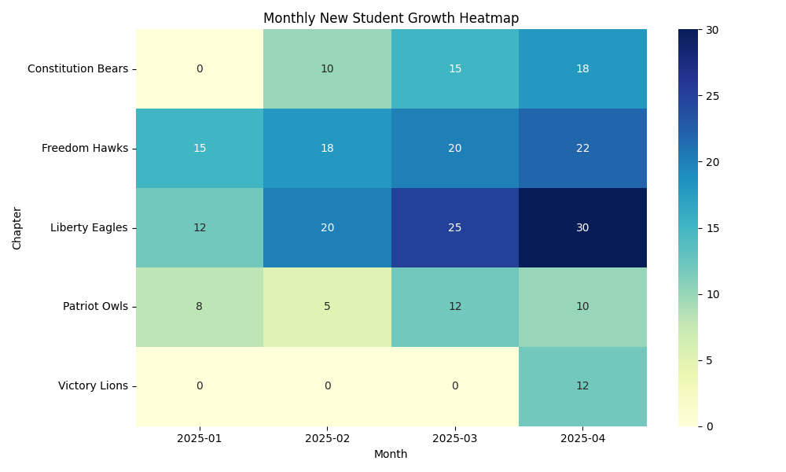

# Chapter Growth & Expansion Report

This report summarizes chapter growth trends, events, and recruitment performance based on collected data.

---

## 📈 Monthly Growth Over Time

---

## 📊 Total Students by Chapter

---

## 🔎 Events vs. Students

---

## 🌍 Growth Heatmap

---

## ✅ Key Takeaways
1. Hosting more events directly drives higher student recruitment.  
2. Established chapters outperform newer ones but newer chapters show strong growth potential.  
3. Regional differences suggest West and Midwest are strong, while East may need more support.  

---

📌 *Generated automatically using Python (Pandas, Seaborn, Matplotlib).*
