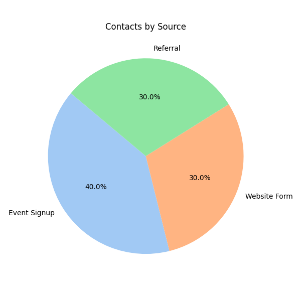

# Student Contacts Dashboard

This dashboard summarizes student contact analytics for the High School Department.

---

## 1️⃣ Weekly Growth

**Insight:** Student contacts are growing steadily week by week. Peaks often follow major events or outreach campaigns.

---

## 2️⃣ Contacts by State

**Insight:** Recruitment is strongest in Texas and Arizona, with California and Florida showing emerging trends. Regional differences may guide targeted outreach.

---

## 3️⃣ Contacts by Source

**Insight:** Event Signups contribute the largest portion of contacts, followed by Website Forms and Referrals. Optimizing the most effective channels can improve recruitment.

---

## 📌 Key Takeaways
- Hosting more events drives measurable increases in student contacts.  
- Focus on high-performing states for maximum impact.  
- Source analysis helps allocate resources effectively between events, website, and referrals.

---

*Generated automatically using Python (Pandas, Seaborn, Matplotlib) — ready for portfolio showcase.*
